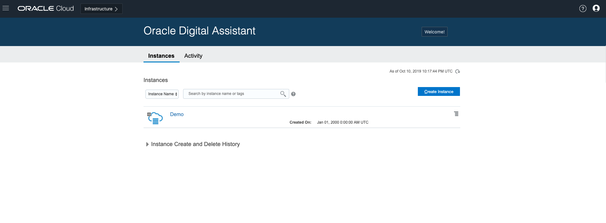
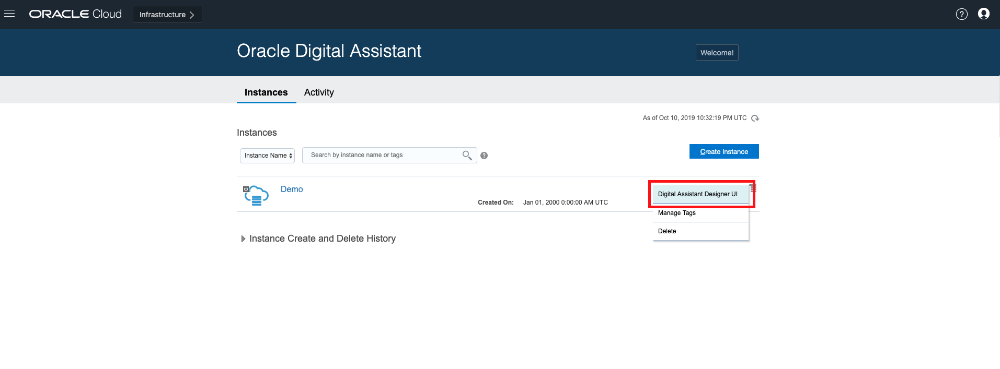
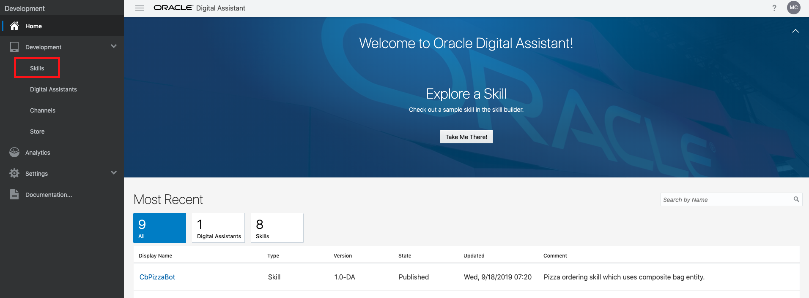
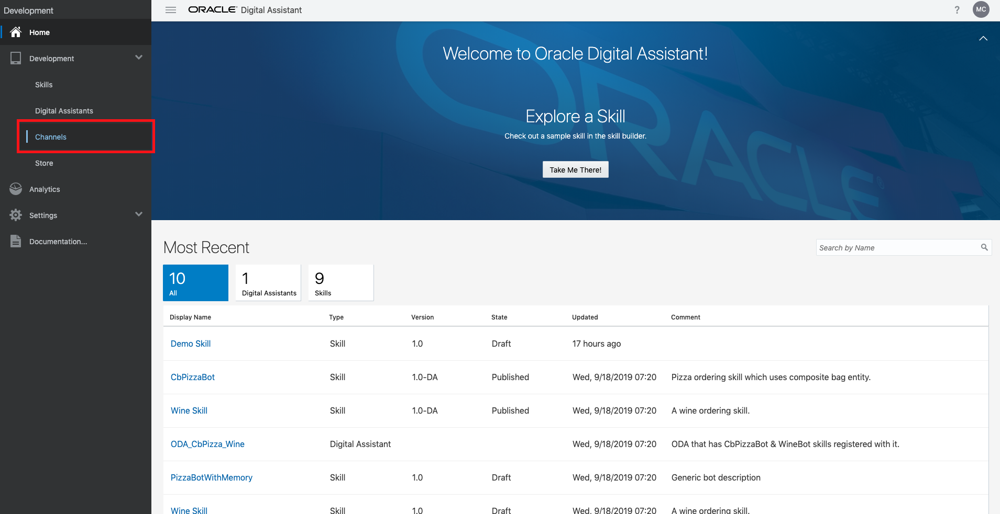
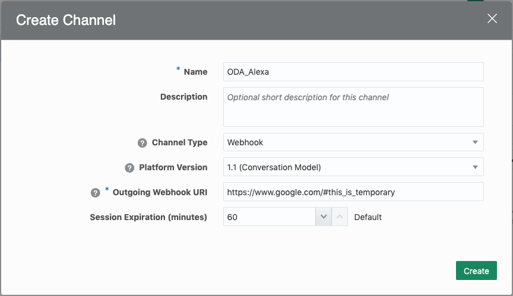
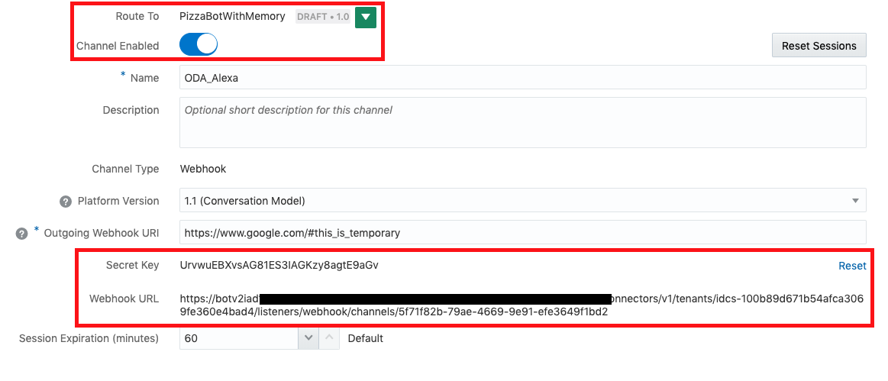

# ODA-Alexa Integration - Digital Assistant Set Up

This part of the lab builds the ODA-side of the integration.

***To log issues***, click here to go to the [github oracle](https://github.com/oracle/learning-library/issues/new) repository issue submission form.

## Objectives

- Obtain an Oracle Cloud Free Tier Account
- Use a skill (that you can optionally build)
- Set up a channel that generates a webhook

## Steps

### **STEP 1**: Your Oracle Cloud Account

- You have already applied for and received your Oracle Cloud Free Tier Account and will change the default password.

### **STEP 2**: Log in to your account

- Once you receive the **Your Cloud Account is fully provisioned** Email, make note of your **Username and Cloud Account Name**.   *Note: `Usernames are usually your email address.`*  You can login by clicking the Sign In button or access it from any browser.

    

- From any browser go to oracle.com to access our Cloud.

    [https://www.oracle.com/](https://www.oracle.com/)

    

- Click the icon in the upper right corner.  Click on **Sign in to Cloud** at the bottom of the drop down.  *NOTE:  Do NOT click the Sign-In button, this will take you to Single Sign-On, not the Oracle Cloud*

    

- Enter your **Cloud Account Name** in the input field and click the **My Services** button. If you have a Free Tier account provisioned, this can be found in your welcome email. Otherwise, this will be supplied by your workshop instructor.

      

- Enter your **Username** and **Password** in the input fields and click **Sign In**.

     

  **NOTE**: You will likely be prompted to change the temporary password listed in the welcome email. In that case, enter the new password in the password field.

### **STEP 3**: Create an instance on digital assistant

We will create a digital assistant instance.

- Click the **hamburger icon** in the upper left corner to open the navigation menu. Under the **Platform Services** section of the menu, click **Digital Assistant**. This opens up a new tab.

     

- If you already see an instance, move on to **STEP 4**. Otherwise, you will need to create a new instance. Click **Create Instance**. In the **Instance Name** field, enter any name you want. For this example we will be using the name `Demo` going forward. Enter a **Description** of your choice. For **Region**, leave as `No Preference`. Click **Next**, then **Create**.

  
  

- In a moment, your new Digital Assistant Instance will show up in the list.

     

### **STEP 4**: Create a skill

Next, we need to build a skill on digital assistant.

- Click the **small hamburger icon** on the right of the newly provisioned instance (near the "Created On" text) and click **Digital Assistant Designer UI**

  

- Click the **hamburger icon** in the upper left corner to open the navigation menu. Under the **Development** section of the menu, click **Skills**

  

- Please [click this link](https://docs.oracle.com/en/cloud/paas/digital-assistant/tutorial-skill/index.html) to build a skill. Alternatively, there will be a few example skills ready to use in your tenancy.

### **STEP 5**: Set up the web channel

Next, we will set up the webhook. ODA manages webhooks and similar artifacts using **channels**.

- Click the **hamburger icon** in the upper left corner and expand **Development** to click on **Channels**.

  

- Enter the **Name**, and set the **Channel Type** to "Webhook". Ensure that the **Platform Version** is "1.1 (Conversation Model)", and finally for **Outgoing Webhook URI** enter a temporary Webhook URI here. We will change this later in lab 200. Click **Create**

  

- You will see a **Secret Key** and **Webhook URL** similar to below. In the **Route To** green drop-down menu arrow, select the skill created/selected in **STEP 4**. Finally, toggle the **Channel Enabled** switch so that it is on. The final result should look something like this:

  

- Keep track of the Secret Key and Webhook URL. You will need these in lab 100.

**This completes the set up on Oracle Digital Assistant!**

**You are ready to proceed to [Lab 100](ODA-Alexa-100.md)**

