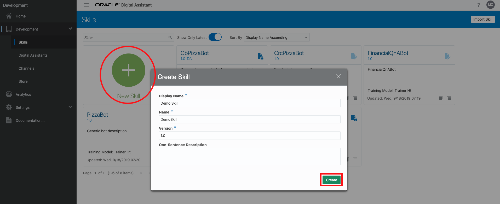
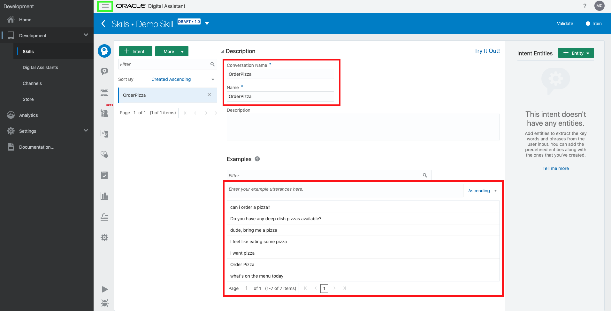
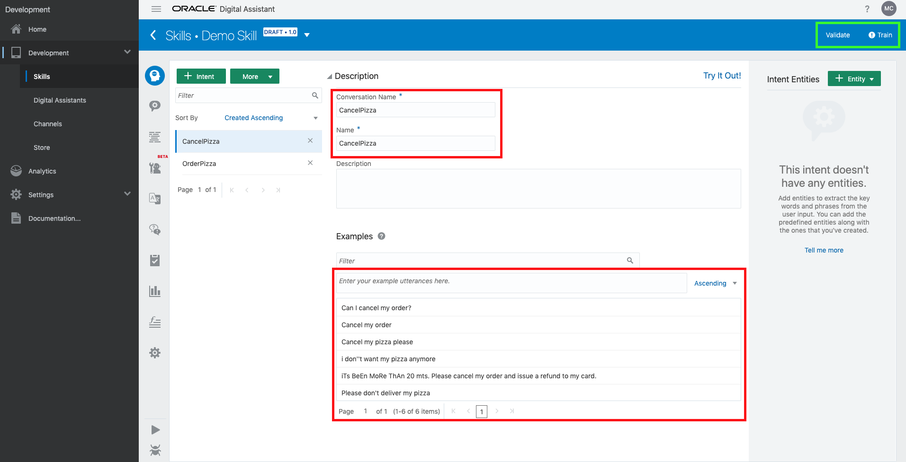
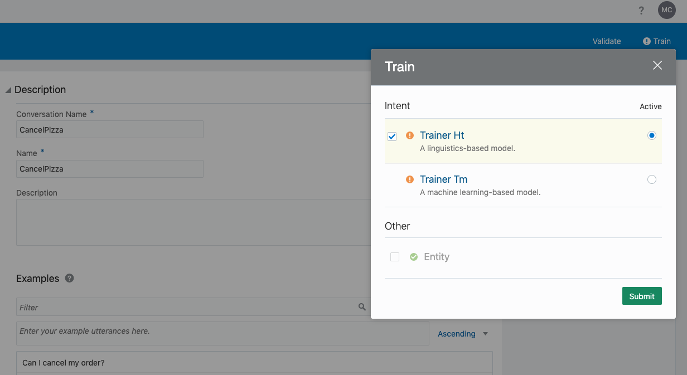
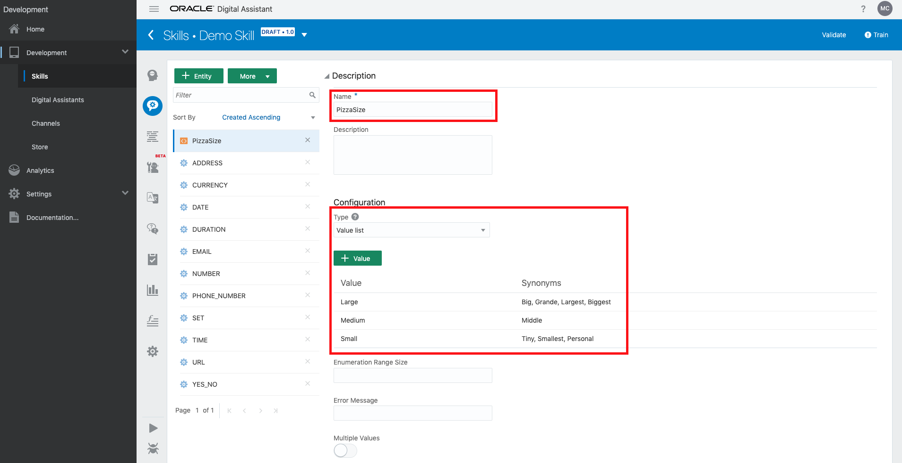
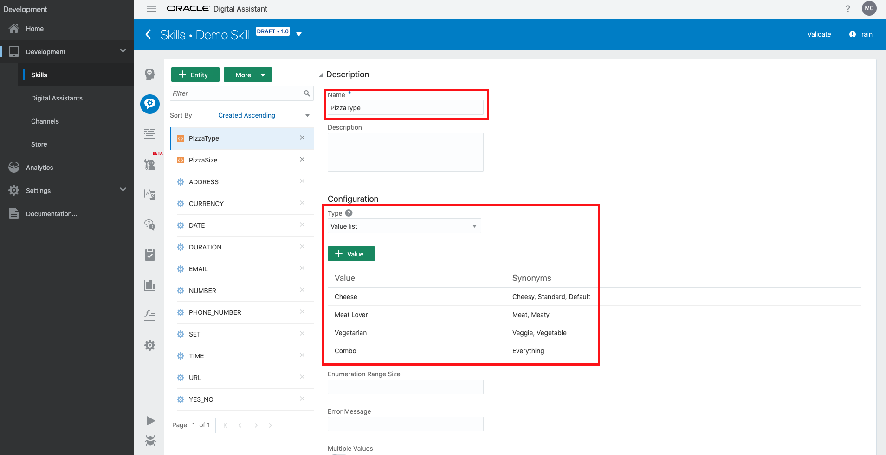

# ODA-Alexa Integration - Digital Assistant Set Up


## Introduction

This lab discusses the steps taken to build an integration between an Amazon Alexa device and Oracle Digital Assistance. The purpose of doing so is to allow someone to use a smart speaker device to verbally talk to their digital assistant instead of using a typing keyboard interface.

A **digital assistant** is a user interface driven by artificial intelligence that helps users accomplish a variety of tasks in natural language conversations. A **skill** is a specific chatbot that handles a very specific task, such as managing interactions with a bank or restaurant. Digital assistants consist of one or more skills, and as such are more powerful and versatile than a single chatbot.

***To log issues***, click here to go to the [github oracle](https://github.com/oracle/learning-library/issues/new) repository issue submission form.

## Objectives

- Obtain an Oracle Cloud Free Tier Account
- Build a simple skill
  - Create and understand intents, utterances, and intents
  - Understand the given conversation flow
- Set up a channel that generates a webhook

# Log into your new Oracle Cloud Account

You will create the skill within your Oracle Cloud Free Tier account.

## Your Oracle Cloud Free Tier Account

### **Step 1**: Your Oracle Cloud Account

- You have already applied for and received your Oracle Cloud Free Tier Account and will change the default password.

### **STEP 2**: Log in to your account

- Once you receive the **Your Cloud Account is fully provisioned** Email, make note of your **Username and Cloud Account Name**.   *Note: `Usernames are usually your email address.`*  You can login by clicking the Sign In button or access it from any browser.

    

- From any browser go to oracle.com to access our Cloud.

    [https://www.oracle.com/](https://www.oracle.com/)

    

- Click the icon in the upper right corner.  Click on **Sign in to Cloud** at the bottom of the drop down.  *NOTE:  Do NOT click the Sign-In button, this will take you to Single Sign-On, not the Oracle Cloud*

        

- Enter your **Cloud Account Name** in the input field and click the **My Services** button. If you have a Free Tier account provisioned, this can be found in your welcome email. Otherwise, this will be supplied by your workshop instructor.

      

- Enter your **Username** and **Password** in the input fields and click **Sign In**.

     

  **NOTE**: You will likely be prompted to change the temporary password listed in the welcome email. In that case, enter the new password in the password field.

### **STEP 3**: Navigate to Digital Assistant

We will build the skill in digital assistant.

- Click the **hamburger icon** in the upper left corner to open the navigation menu. Under the **Platform Services** section of the menu, click **Digital Assistant**. This opens up a new tab.

     

- Click **Create Instance**. In the **Instance Name** field, enter any name you want. For this example we will be using the name `Demo` going forward. Enter a **Description** of your choice. For **Region**, leave as `No Preference`. Click **Next**, then **Create**.

  
  

- In a moment, your new Digital Assistant Instance will show up in the list.

     

### **STEP 4**: Create a skill

Next, we need to build a skill on digital assistant. If you would like to build a more complex skill, [click this link](https://docs.oracle.com/en/cloud/paas/digital-assistant/tutorial-skill/index.html). For this demo, we will build a simplified version of the pizza chat bot linked in the previous sentence. The chat bot will be able to

- Click the **small hamburger icon** on the right of the newly provisioned instance (near the "Created On" text) and click **Digital Assistant Designer UI**

  

- Click the **hamburger icon** in the upper left corner to open the navigation menu. Under the **Development** section of the menu, click **Skills**

  

- Click **New Skill**. For the **Display Name** enter "Demo Skill". The **Name** field, which functions as a unique ID for the skill, will be autofilled to "DemoSkill". The version will also be autofilled to "1.0". Click **Create**

  

  **NOTE**: From here on out, the background content might vary from here on out. This will not affect the tutorial.

- Now you will define a few intents. An intent is what the digital assistant uses to categorize incoming utterances. For the purpose of this demo, we will create two intents. Click the green button **+Intent** and change both the **Conversation Name** and **Name** to "OrderPizza". Under **Examples**, in the text box with placeholder text "Enter your example utterances here", add at least 5 examples of what a user would say to _order pizza_. To add your utterance, type the utterance in the text box and press enter (punctuation and capitalization do not matter). Your screen should roughly look like ours in the below picture:

  

  **NOTE**: To close and toggle the grey "Development" menu on the left, click the hamburger menu (shown by the green box).

- Make another intent by clicking **+Intent**. Set **Conversation Name** and **Name** "CancelPizza", and add at least 5 utterances of what a user would say to _cancel an order of pizza_. Your screen should roughly look like ours in the below picture:

  

- In the previous picture, the **Validate** and **Train** tools are boxed in green. We will use both of these tools to ensure that the bot is working as intended. First, we will train our bot to build the first Natural Language Understanding (NLU) model. Click **Train**, ensure that **Trainer Ht** is selected (in general, **Trainer Tm** is used for more complex models), and click **Submit**. After a few seconds, the exclamation icon next to the **Train** tool will turn into a check mark icon, indicating that the model is ready to go

  

  **NOTE**: To test an utterance, click **Try It Out!** on the intent view. This opens a dialog on the right side where you can test the model on specific utterances. For instance, if you test "Give me pizza", the model should correctly guess that you are trying to OrderPizza instead of CancelPizza. Alternatively, if you test something unrelated like "chair potato pickle bottle" the model will most likely correctly fail to categorize that utterance as OrderPizza or CancelPizza.

  You are halfway done building this skill!

- Next, we will create some entities. Currently, on the left menu of icons, the icon of a head with dots (Intent) should be selected. Select the icon under that (a speech bubble with a gear). Click **+Entity** and change the **Name** to "PizzaSize". Since there are _discrete_ categorizations of pizza sizes (small, medium, etc), make sure the **Type** under **Configuration** is a "Value list". Click **+Value**. For **Value** enter "Small", and for **Synonyms** enter "Tiny, Smallest, Personal". Continue adding values according to the following table:

  | Value | Synonyms |
  | ----- | -------- |
  | Small | Tiny, Smallest, Personal |
  | Medium | Middle |
  | Large | Big, Grande, Largest, Biggest |
  
  

  Create another entity with **Name** "PizzaType", **Type** "Value list", and with values according to the following table:

  | Value | Synonyms |
  | ----- | -------- |
  | Cheese | Cheesy, Standard, Default |
  | Meat Lover | Meat, Meaty |
  | Vegetarian | Veggie, Vegetable |
  | Combo | Everything |

  

### **STEP 5**: Add a Security List entry

A security list provides a virtual firewall for an instance, with ingress and egress rules that specify the types of traffic allowed in and out. Each security list is enforced at the instance level. However, you configure your security lists at the subnet level, which means that all instances in a given subnet are subject to the same set of rules. The security lists apply to a given instance whether it's talking with another instance in the VCN or a host outside the VCN.

- In the DockerVCN network click on **Security Lists**

  

- Click on **Default Security List for DockerVCN**

  

For the purposes of the upcoming Docker deployments we need to add five Ingress Rules that allow access from the Internet to ports 9080, 8002, 18002, 5600, and 8085. In a production environment only the UI port (8085) would typically be opened for access but the labs will have us test various other Application and Oracle centric functionality as we go, thus the need to open other ports.

- Click **Add Ingress Rule**

  **`NOTE: DO NOT EDIT AN ALREADY EXISTING RULE, ADD NEW ONES...`**

  

- In the Pop up dialog **Enter the following** and then click the **Add Ingress Rule** button.

  **NOTE: Leave all other values at default...**

  ```
  Source CIDR: 0.0.0.0/0
  Destination Port Range: 8085
  ```

  


- **Add four more Ingress Rules**

  ```
  Source CIDR: 0.0.0.0/0
  Destination Port Range: 9080
  ```

  ```
  Source CIDR: 0.0.0.0/0
  Destination Port Range: 8002
  ```

  ```
  Source CIDR: 0.0.0.0/0
  Destination Port Range: 18002
  ```

  ```
  Source CIDR: 0.0.0.0/0
  Destination Port Range: 5600
  ```

- When completed your Ingress Rules should look like:

  

### **STEP 6**: Create SSH Key Pair (Linux or Mac client)

Before we create the Compute instance that will contain Docker and application deployments we need to create an ssh key pair so we'll be able to securely connect to the instance and do the Docker installation, etc.

**NOTE:** `This step focuses on key pair generation for Linux or Mac based terminal sessions. If your going to run your terminal sessions from a Windows client then skip to STEP 7`

- In a `Linux/Mac` client terminal window **Type** the following (**You don't have to worry about any passphrases unless you want to enter one**)

  ```
  ssh-keygen -b 2048 -t rsa -f dockerkey
  ```

- Your key pair is now in the current directory

  

  **NOTE for Linux and Mac Clients:** Just open up the pubic key file in an editor (vi) and select / copy the entire contents to be used in Step 8.   

  

### **STEP 7**: Create SSH Key Pair (Windows client)

For Windows clients this example will show the use of PuttyGen to generate the keypair. [Putty and PuttyGen](https://www.chiark.greenend.org.uk/~sgtatham/putty/latest.html) are available for download.

- Run **PuttyGen** and click **Generate**

  

- Once the generation process completes click the **Save Private Key** button and save to a directory of your choice.

- If prompted to save without a passphrase click yes.

  

  **NOTE:** `Do not save the public key as the format is not compatable with Linux openSSH.

- Instead, **Select the entire Public Key in the display and right-click copy**. `This content will be pasted into the Create Instance dialog in Step 8.`

  

### **STEP 8**: Create a Compute Instance

You will now create a Linux based Compute instance using the public key you just generated.

- Go back to your OCI console and from the hamburger menu in the upper left hand corner select **Compute-->Instances**

  

- Click **Create Instance**

 

- **You will (Select / Leave Default) or Type** the following in the `Create Compute Instance` section of the dialog:

  
  - Name: Docker
  - Image Operating System: Oracle Linux 7.6 (Default)
    
  - Expand the **Show Shape, Network and Storage Options** button, accept the defaults and ensure the `Always Free Eligible` is chosen.
  - Availability Domain: AD 1 (Use default AD 1)
  - Shape Type: Virtual Machine (Default)
  - Shape: VM.Standard2.1 (Default)
    
 
  - Select the `demo` compartment you just created.  
    
  - The VCN network `DockerVCN` you created should populate.
      
  - Select the subnet compartment you created

    
  - Boot Volume: Oracle-Provided OS Image (accept all defaults)


 

- Scroll down furthur on the page to add your PUBLIC SSH Key
**NOTE:** You will paste the public key you copied in Step 7 into the SSH KEY field by selecting the **Paste SSH Keys** radio button. `The public key should all be on ONE LINE`

  


- Click **Create**

  After a few minutes you should see a running instance with a Public IP Address.

- `Make a note of the IP Address as we will be using this in the next step.`

  

### **STEP 9**: SSH into the Instance and install Docker

The last set up piece will be to SSH into the Compute image and install Docker and GIT.

- For a Windows client session bring up Putty, select the **Session** section and type in the IP address:

  

- Select the **Data** section and enter the following as the username:

  ```
  opc
  ```

  Screenshot:

  

- Select **SSH-->Auth** and browse to the Private Key you created back in Step 7:

  

- Click the **Open** button. You will presented the first time with am alert message. Click **Yes**

  

- You will logged into the Compute image:

  

- **NOTE: For Linux and Mac client sessions**: "cd" into the directory where your key pair is. Make sure the dockerkey file has the permissions of "600" (chmod 600 dockerkey) and ssh into the compute instance `substituting your IP address`.

  Example:

  ```
  cd <directory of your key pair>
  chmod 600 dockerkey
  ssh -i ./dockerkey opc@129.213.119.105
  ```

- Linux / Mac screenshot:

  

### **STEP 10**: Install and configure Docker and GIT

Docker and GIT are required for the subsuquent labs. You will install the Docker engine, enable it to start on re-boot, grant docker privledges to the `opc` user and finally install GIT.

- **Type** the following:

  ```
  sudo -s
  yum install docker-engine
  usermod -aG docker opc
  systemctl enable docker
  systemctl start docker
  ```

  **NOTE:** During the `yum install docker-engine` command press `Y` is asked if installation is ok.

- Screenshot at the end of the Docker installation:

  

  

- **Type** the following:

  ```
  yum install git
  ```

- Screenshot at the end of the GIT installation:

  

- **Type** the following to verify good installations:

  ```
  su - opc
  docker version
  docker images
  git --version
  ```

  

### **STEP 11**: Edit /etc/sysconfig/selinux

Set the server to Permissive mode and also ensure that permissive mode survives re-boots by editing `/etc/sysconfig/selinux`

- Using vi, change the SELINUX line to **permissive**. **Type** the following: (**NOTE**: You need to be the root user to edit this file)

  ```
  sudo -s
  vi /etc/sysconfig/selinux
  ```

  **NOTE:** If new to vi, press the letter `i` to edit text. To save press Escape, the type `:wq!`.

  

- Save the file and exit out of vi

- Now, **Type** the following:

  ```
  setenforce 0
  sestatus
  ```

- Verify that your server is in permissive mode.

  

- **Type** the following to exit out of `root` and go back and verify that you're now the `opc` user:

  ```
  exit
  whoami
  ```

  

**This completes the Set Up!**

**You are ready to proceed to [Lab 100](ODA-Alexa-100.md)**

