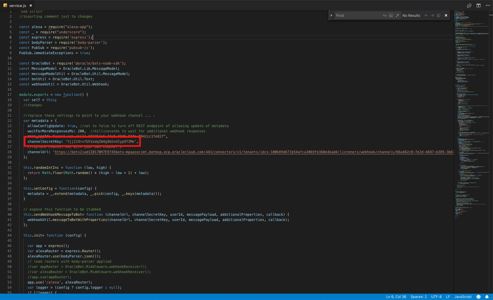

Updated: October 14th, 2019

## Introduction

In this lab we will explain how to setup a heroku server leveraging the existing NodeJS server found [here](https://blogs.oracle.com/mobile/adding-alexa-as-a-conversation-channel-to-your-oracle-digital-assistant-chatbot)
You will use various commands to install heroku on your local environment. 

## Objectives
- Create Heroku Account
- Setup Heroku on local computer
- Prepare the application
- Deploy the application
- Configure NodeJS server
    - Update Amazon AppID
    - Update Channel Secret Key and Channel URL 
- Redeploy NodeJS server on Heroku
    - Setup (Install heroku on your local environment
    - Prepare the application
    - Deploy the application
    - View the logs

## Required Artifacts
- Oracle Digital Assistant Skill
- Heroku Account
- Download the NodeJS code [here](https://blogs.oracle.com/mobile/adding-alexa-as-a-conversation-channel-to-your-oracle-digital-assistant-chatbot)

# Create Heroku Account
Follow this [link](https://signup.heroku.com/?c=70130000001xDpdAAE&gclid=Cj0KCQjwuZDtBRDvARIsAPXFx3DyRB323ksXfO_lYs7W14RB6CRCTQjMBNQTOuElUazr4rbuGysu78waAvLDEALw_wcB) to create a heroku account. 

# Heroku setup
Follow this [link](https://devcenter.heroku.com/articles/getting-started-with-nodejs#set-up) to set up Heroku on a local computer

# Change package.json
Inside of the nodejs server you downloaded there is a file called package.json. Copy and replace with the code below. 
```
{
  "name": "oracle-bot-alexa",
  "version": "1.0.0",
  "description": "Alexa integration",
  "main": "service.js",
  "author": "",
  "license": "",
  "dependencies": {
    "@oracle/bots-node-sdk": "2.0.6",
    "alexa-app": "^4.2.0",
    "body-parser": "^1.15.2",
    "express": "^4.14.0",
    "pubsub-js": "^1.5.4",
    "underscore": "^1.8.3",
    "util": "^0.10.3"
  },
  "scripts": {
    "start": "node index.js"
  }
} 
```
# Heroku application deployment setup
## Follow the below steps to create an app in heroku and deploy the sample code
### **STEP 1**: Go to heroku dashboard and create an app
  -  
  Give it any name you want.
  ***OR***
  Create an app from the [cli](https://devcenter.heroku.com/articles/creating-apps)
  

### **STEP 2**: Open NodeJS directory
  - In your terminal go **INTO** the nodejs directory you downloaded.
  - Run the following commands in terminal: 
  
**Create a new GIT repo**
```
heroku login
git init
heroku git: remote -a <INSERT APP NAME>
```

# Create webhook in Oracle Digital Assistant
## In this section we will create a webhook in Oracle Digital Assistant, change service.js, and redeploy the application.
### **Pre-step**: Copy heroku app URL
Go to your heroku app, **click open app** and copy the **URL** in the new tab that was opened.

### **STEP 1**: Go to your Oracle Digital Assistant Instance.

### **STEP 2**: Create a channel of type "Webhook".
-Give it a name of your choice. 
-The **outgoing webhook URL** will be: **/<URL-THAT-YOU-JUST-COPIED/>/singleBotWebhook/messages** 

### **STEP 3**: Route To your Digital Assistant Skill

### **STEP 3**: Enable the channel

### **STEP 4**: Copy SECRET KEY and Webhook URL in the newly created webhook.

   

  
# Deploy nodejs application
## Before we redeploy the NodeJS application we need to make some changes in ***service.js***
### **STEP 1**: Open service.js in a code editor
### **STEP 2**: Change amazon application ID in service.js
 -Use the amazon application id you copied earlier and copy it here:

### **STEP 3**: Change channelSecretKey in service.js

### **STEP 4**: Change channelUrl in service.js

### **STEP 5**: Deploy nodeJS application
Open up terminal and navigate to your directory to where you NodeJS server is located. 

-**To deploy your application**
    ```
    git add .
    git commit -am "redeploying with correct variables"
    git push heroku master
    ```
### **STEP 6**: Test in Alexa Developer Console
Navigate to your alexa skill and select the test tab. You will be able to interact with you newly created skill by typing or using your microphone. The format to test is as follow:
```
Alexa, ask <invocation name> <question your programmed in a Digital Assistant
```
  


**This completes the ODA-Alexa Integration Workshop!**

